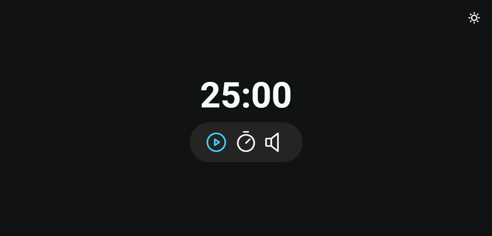

<h1 align="center">Focus Timer 1.0</h1>

[Projeto](#projeto) &nbsp;&nbsp;&nbsp;|&nbsp;&nbsp;&nbsp; [Tecnologias](#tecnologias)
&nbsp;&nbsp;&nbsp;|&nbsp;&nbsp;&nbsp; [TODO-List](#todo) &nbsp;&nbsp;&nbsp;|&nbsp;&nbsp;&nbsp;
[Layout](#layout) &nbsp;&nbsp;&nbsp;|&nbsp;&nbsp;&nbsp; [Licença](#license)

  

 

 
 

## 💻 Projeto 

Projeto criado durante o 3° Módulo do Stage 5 do Explorer, sendo ele um Timer estilo pomodoro.

Objetivo dessa aplicação é definir um tempo para o contador e quando ele chegar em zero, disparar um
alarme. É possível ouvir um som ambiente de background (ou não) e também pausar, cancelar e editar o
tempo do contador.

Adquiri conhecimentos de desestruturação de dados, padrão de design Factory, modularização,
estruturação de dados, manipulação de eventos e audios, técnicas na prática de como fazer um código
limpo e aprimorando os conhecimentos do ES6.

 
 

## 🚀 Tecnologias 

- HTML
- CSS
- JavaScript

 
 

## 📑 TODO List 

- [ ] Ajustar medidas com o clamp()  
- [ ] Ajustar aplicação para Mobile  
- [ ] Criar modal e substituir o prompt do JS

 
 

## 🔖 Layout 

Você pode visualizar o layout do projeto através
[DESSE LINK](<https://www.figma.com/file/lIO8XadsdNCsZxg4IPQwwl/Explorer-Stage-05-Projeto-01-(Copy)?type=design&node-id=0%3A1&mode=design&t=O2n30hzTlYOrXlIb-1>).
É necessário ter conta no [Figma](https://figma.com) para acessá-lo.

 
 

## 🔒 Licença

Esse projeto está sob a licença MIT.

